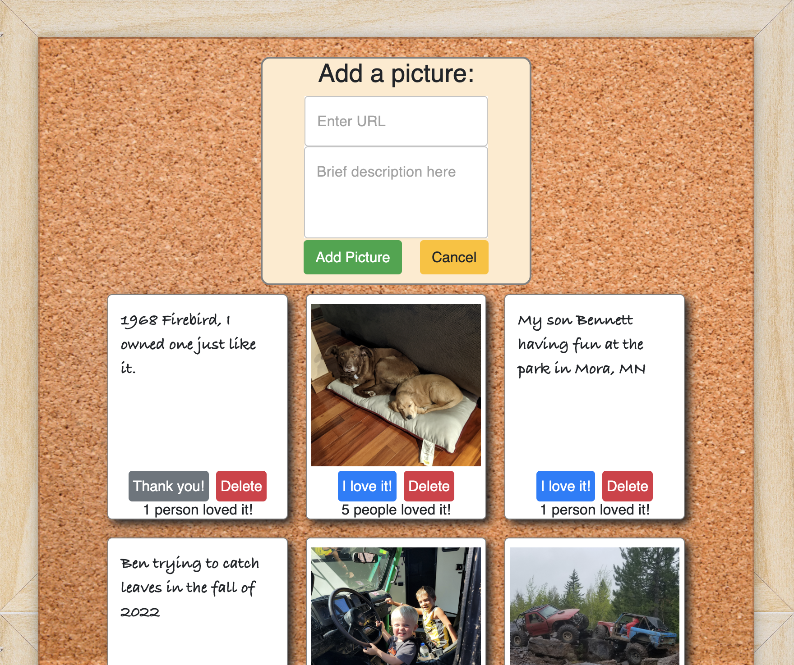

# Project Name

Josh's Photo Gallery

## Description

A simple gallery of some photos that are memorable for me. Users can click on an image to see an additional description as well as mark that they love it. 

I will update this further after stretch goals when I have a more complete project. 

Additional README details can be found [here](https://github.com/PrimeAcademy/readme-template/blob/master/README.md).

# PROJECT NAME

Josh's Photo Gallery

## Description

_Duration: Weekend Challenge_

This project is a gallery of photos that are important or enjoyable to me. Visitors have the ability to do several things:

    - Mark that they enjoyed a photo
    - Click on a photo to see a brief description
    - Add photos of their own
    - Delete photos

## Screen Shot

### Prerequisites

Link to software that is required to install the app (e.g. node).

- [Node.js](https://nodejs.org/en/)
- [Postgres](https://www.postgresql.org/download/)

## Installation

1. Create a database named `react_gallery`,
2. The queries in the `database.sql` file are set up to create all the necessary tables and populate the needed data to allow the application to run correctly. The project is built on [Postgres](https://www.postgresql.org/download/), so you will need to make sure to have that installed. We recommend using Postico to run those queries as that was used to create the queries, 
3. Open up your editor of choice and run an `npm install`
4. Run `npm run server` in your terminal
5. Run `npm run client` in your terminal
6. The `npm run client` command will open up a new browser tab for you!

## Built With

1. React
2. Node.js
3. Express
4. PostgreSQL
5. Bootstrap
6. Material UI 5
7. SweetAlert2
